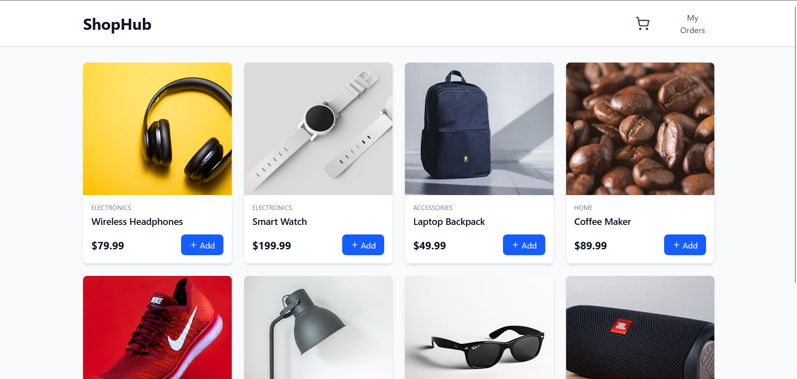
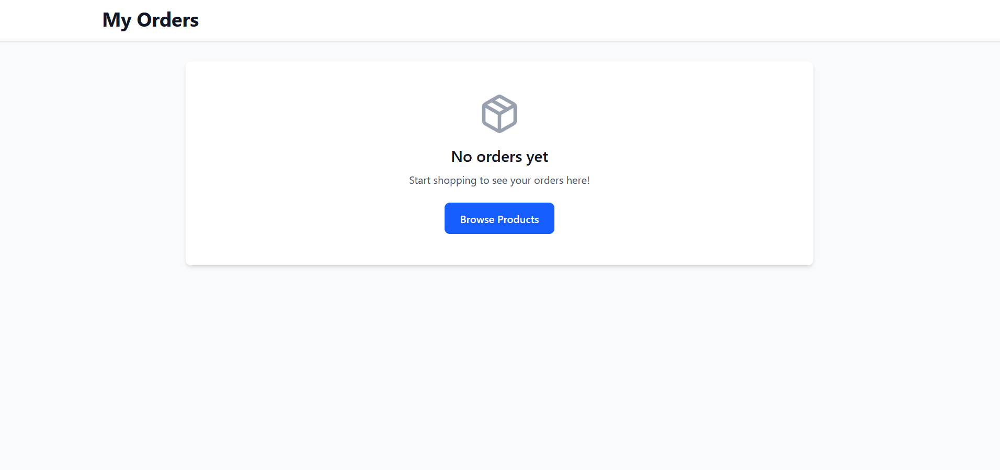
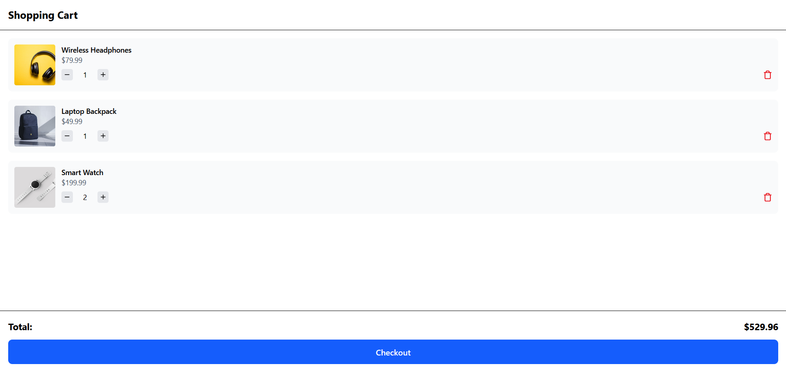
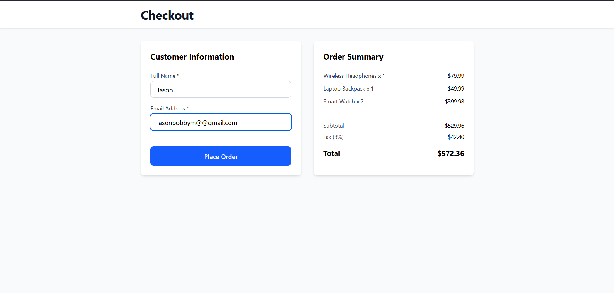
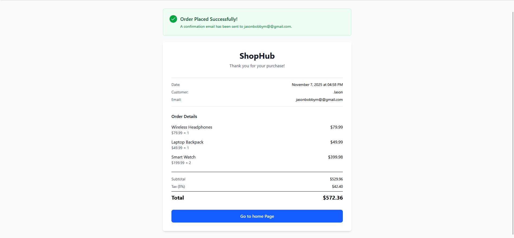
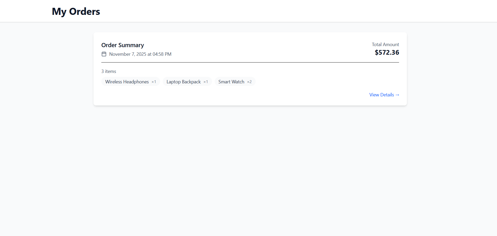

# E-Commerce website

A full-stack e-commerce application built with the MERN stack (MongoDB, Express.js, React, Node.js). Features a shopping cart, product catalog, order management and checkout functionality.

## Prerequisites

Before you begin, ensure you have the following installed:
- [Node.js](https://nodejs.org/) (v14 or higher)
- [MongoDB](https://www.mongodb.com/try/download/community) (v4.4 or higher)
- [npm](https://www.npmjs.com/)

## Installation

### 1. Clone the Repository

```bash
https://github.com/jas212-on/e-commerce-website.git
cd e-commerce-website
```

### 2. Backend Setup

Navigate to the server directory and install dependencies:

```bash
cd server
npm install
```

Install additional packages (if not already in package.json):

```bash
npm install axios express dotenv cors mongoose nodemon
```

Create a `.env` file in the server directory:

```env
PORT=5000
MONGODB_URI=your-mongodb-uri
```

### 3. Frontend Setup

Navigate to the client directory and install dependencies:

```bash
cd ../client
npm install
```
Install additional packages (if not already in package.json):

```bash
npm install axios lucide-react react-router-dom tailwindcss @tailwindcss/vite
```

## Running the Application

### Run Frontend and Backend Separately

**Terminal 1 - Start Backend:**
```bash
cd server
npm start
# or for development with nodemon
npm run dev
```

**Terminal 2 - Start Frontend:**
```bash
cd client
npm run dev
```

The application will open at `http://localhost:5173`

The application will automatically connect to MongoDB using the URI in your `.env` file

### MongoDB Atlas (Cloud)

1. Create a free account at [MongoDB Atlas](https://www.mongodb.com/cloud/atlas)
2. Create a new cluster
3. Get your connection string
4. Update `MONGODB_URI` in your `.env` file:

## Technologies Used

- **Frontend:** React
- **Backend:** Node.js, Express.js
- **Database:** MongoDB, Mongoose
- **Styling:** Tailwind

## Screenshots








